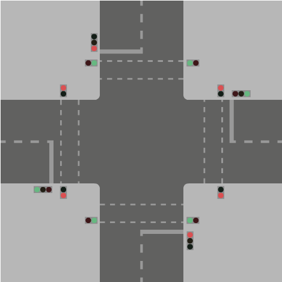
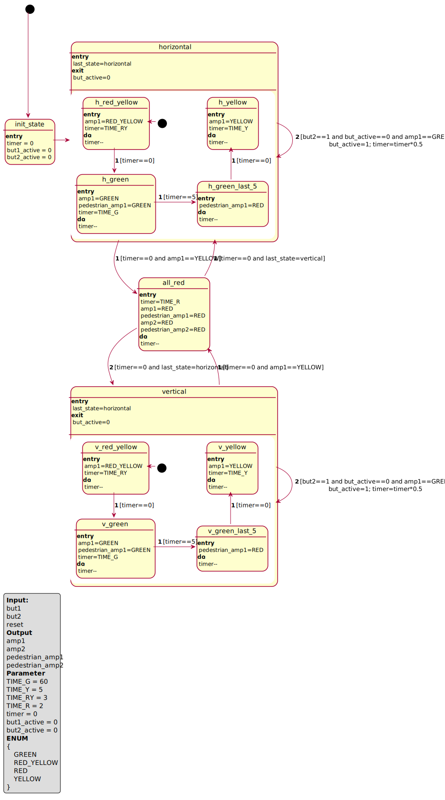

# py_state_machine
python state machine with transition, guards, do, entry, exit functions

# Example
## Picture

## Requirement
1. we have an intersection with two roads that overlap.
1. The traffic lights can be divided into 2 levels:
    1. Horizontal `amp1` & `pedestrian_amp1`
    1. Vertical `amp2` & `pedestrian_amp2`
1. Traffic light runs completely automatically
    1. green runs in 1 minute
    1. yellow transition in 5 seconds
    1. red->yellow transition in 3 seconds
    1. all red for 2 seconds
    1. Vertical timer is 80% of horizontal
    1. if green timer by 5 seconds pedestrian_amp change to red
1. In addition, I would suggest that we add a button (`but1` & `but2`) at the pedestrians, this will reduce the timer by 50%

> Here is my solution, I am happy about the improvements
## UML

